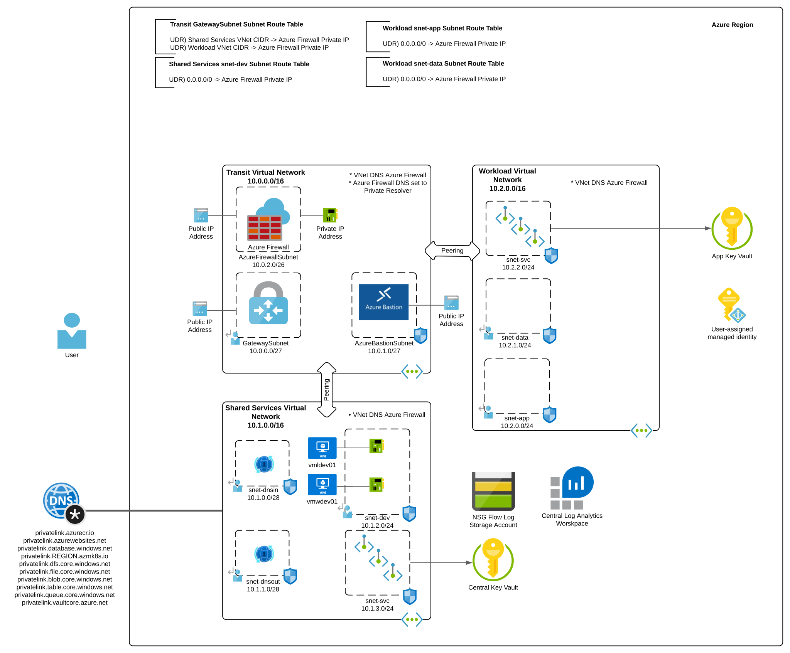

# Azure Hub and Spoke Base Lab

## Overview
This deployable lab provides a simple way to experiment with Azure workloads in an enterprise-like hub and spoke environment. Three resource groups are deployed with one for transit resources, one for shared services, and one for a workload.

A [hub and spoke networking architecture](https://docs.microsoft.com/en-us/azure/architecture/reference-architectures/hybrid-networking/hub-spoke?tabs=cli). [UDRs (User defined routes)](https://docs.microsoft.com/en-us/azure/virtual-network/virtual-networks-udr-overview#user-defined) are used to route all outgoing traffic and traffic between spokes through the Azure Firewall in the hub Virtual Network. The Azure Firewall is also configured as the DNS provider for the attached Virtual Network. Private DNS Zones for common Azure services are deployed and linked to the hub virtual network to support PrivateLink integrations.

In the Shared Services Virtual Network an Ubuntu (virtual machine) is deployed and is pre-loaded with Azure CLI, kubectl, and Docker. 

The Workload Virtual Network is deployed with an app, data, and supported services (PaaS services behind Private Endpoints). The workload resource group also contains a user-assigned managed identity which has been given permissions to get and list secrets in a Key Vault instance.

Additional features included:

* Azure Bastion provisioned in the hub to provide SSH and RDP (Remote Desktop Protocol) to deployed virtual machines
* Azure Firewall configured to send diagnostic logs to an instance of Log Analytics Workspace to allow for review of the traffic flowing to and from the Azure Function
* An Azure Key Vault instance which stores the user configured VM administrator username and password
* An Azure Key Vault instance for workloads deployed into the workload resource group
* All instances of Azure Key Vault are deployed with a Private Endpoint
* All subnets that support Network Security Groups are configured with them
* Network Security Groups are configured with NSG Flow Logs which are set to an Azure Storage Account and Traffic Analytics

## Prerequisites
1. You must hold at least the Contributor role within each Azure subscription you configure the template to deploy resources to.

2. Get the object id of the security principal (user, managed identity, service principal) that will have access to the Azure Key Vault instance. This will be used for the keyVaultAdmin parameter of the template.

**az ad user show --id someuser@sometenant.com --query objectId --output tsv**

3. Enable Network Watcher in the region you plan to deploy the resources using the Azure Portal method described in this link. Do not use the CLI option because the templates expect the Network Watcher resource to be named NetworkWatcher_REGION, such as NetworkWatcher_eastus2. The CLI names the resource watcher_REGION such as watcher_eastus2 which will cause the deployment of the environment to fail.

## Installation with Azure Portal

## Installation with Azure CLI
1. Set the following variables:
   * DEPLOYMENT_NAME - The name of the location
   * DEPLOYMENT_LOCATION - The location to create the deployment
   * LOCATION - The location to create the resources
   * ADMIN_USER_NAME - The name to set for the VM administrator username
   * ADMIN_OBJECT_ID - The object ID of the Azure AD User that will have full permissions on the Key Vault instances
   * SUBSCRIPTION - The name or id of the subscription you wish to deploy the resources to
   * ON_PREM_ADDRESS_SPACE - This is an optional parameter that represents on-premises address space

2. Set the CLI to the subscription you wish to deploy the resources to:

   * **az account set --subscription SUBSCRIPTION_ID**

4. Deploy the lab using the command (tags parameter is optional): 

   * **az deployment sub create --name $DEPLOYMENT_NAME --location $DEPLOYMENT_LOCATION --template-uri https://raw.githubusercontent.com/mattfeltonma/azure-labs/master/hub-and-spoke/azuredeploy.json --parameters location=$LOCATION vmAdminUsername=$ADMIN_USER_NAME keyVaultAdmin=$ADMIN_OBJECT_ID tags='{"mytag":"value"}'**

3.  You will be prompted to provide a password for the local administrator of the virtual machine. The username and password you set will be available to you as secrets in the "central" Key Vault provisioned as part of this lab.

## Post Installation
Once the lab is deployed, you can SSH into the Dev VM running in the hub using Azure Bastion.

