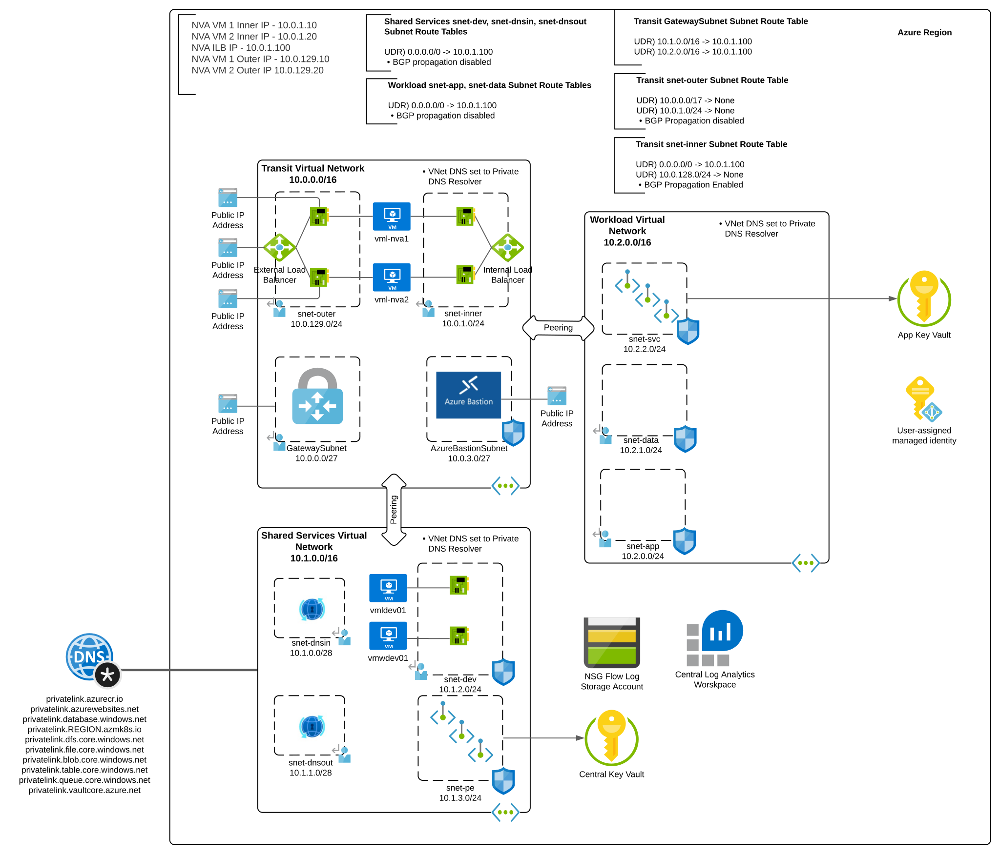

# Azure Hub and Spoke Network Virtual Appliance Lab

## Updates
* 11/20/2022 - Initial release

## Overview
Enterprises building in Azure often have requirements that demand the use of NVAs (network virtual appliances) such as a third-party firewall. These third-party solutions are often used in place of first-party solutions such as Azure Firewall and require licensing that makes it prohibitive to experiment with.

This deployable lab seeks to address that challenge by providing a set of VMs (virtual machines) configured with open-source tools to allow the machine to act as a router and firewall. Each VM runs Ubuntu and is configured to use the [native VRF (virtual routing and forwarding) capability](https://www.kernel.org/doc/html/latest/networking/vrf.html) in the Linux kernal. [iptables] is used for a firewall and NAT (network address translation). [Quagga](https://www.nongnu.org/quagga/) is installed and ready to be configured to experiment with dynamic routing using BGP (border gateway protocol). The Ubuntu VMs include two network interfaces, one acting as the outer interface associated with a public IP and the other acting as an inner interface. The inner interface has been placed behind an Internal Load Balancer configured with [haports](https://learn.microsoft.com/en-us/azure/load-balancer/load-balancer-ha-ports-overview). The outer interface is configured as a backend to an External Load Balancer and can be further configured to ingress traffic from the public Internet to an application in a spoke.

The network is deployed in a [hub and spoke networking architecture](https://docs.microsoft.com/en-us/azure/architecture/reference-architectures/hybrid-networking/hub-spoke?tabs=cli). [UDRs (User defined routes)](https://docs.microsoft.com/en-us/azure/virtual-network/virtual-networks-udr-overview#user-defined) are used to route all outgoing traffic and traffic between spokes through the Ubuntu VMs in the hub Virtual Network. A [VPN VNG (Virtual Network Gateway)](https://learn.microsoft.com/en-us/azure/vpn-gateway/vpn-gateway-about-vpngateways) is provisioned in the hub if on-premises connectivity is required and has been configured to route traffic to spokes through the Ubuntu VMs.

The Shared Services Virtual Network contains an [Azure Private DNS Resolver](https://learn.microsoft.com/en-us/azure/dns/dns-private-resolver-overview) and is linked to multiple Azure Private DNS Zones used by common Azure PaaS services. All virtual networks are configured to use the Private DNS Resolver for DNS resolution. Ubuntu and Windows VMs are deployed as utility servers. The Windows VM comes loaded with Google Chrome, Visual Studio Code, Azure CLI, and Azure PowerShell. The Linux VM comes loaded with Azure CLI, kubectl, and Docker. 

The Workload Virtual Network is deployed with an app, data, and supported services (PaaS services behind Private Endpoints). The workload resource group also contains a user-assigned managed identity which has been given permissions to get and list secrets in a Key Vault instance.

Additional features included:

* Azure Bastion provisioned in the hub to provide SSH and RDP (Remote Desktop Protocol) to deployed virtual machines
* Virtual Network Gateway deployed to the hub and configured to route traffic through the internal load balancer in front of the Ubuntu VMs.
* An Azure Key Vault instance which stores the user configured VM administrator username and password
* An Azure Key Vault instance for workloads deployed into the workload resource group
* All instances of Azure Key Vault are deployed with a Private Endpoint
* All subnets that support Network Security Groups are configured with them
* Network Security Groups are configured with NSG Flow Logs which are set to an Azure Storage Account and Traffic Analytics
* Subnets are configured so that Private Endpoints support Network Security Groups

## Prerequisites
1. You must hold at least the Contributor role within each Azure subscription you configure the template to deploy resources to.

2. Get the object id of the security principal (user, managed identity, service principal) that will have access to the Azure Key Vault instance. This will be used for the keyVaultAdmin parameter of the template. Ensure you are using the most up to date version of az cli.

**az ad user show --id someuser@sometenant.com --query id --output tsv**

3. Enable Network Watcher in the region you plan to deploy the resources using the Azure Portal method described in this link. Do not use the CLI option because the templates expect the Network Watcher resource to be named NetworkWatcher_REGION, such as NetworkWatcher_eastus2. The CLI names the resource watcher_REGION such as watcher_eastus2 which will cause the deployment of the environment to fail.

## Installation with Azure Portal

## Installation with Azure CLI
1. Set the following variables:
   * DEPLOYMENT_NAME - The name of the location
   * DEPLOYMENT_LOCATION - The location to create the deployment
   * LOCATION - The location to create the resources
   * ADMIN_USER_NAME - The name to set for the VM administrator username
   * ADMIN_OBJECT_ID - The object ID of the Azure AD User that will have full permissions on the Key Vault instances
   * SUBSCRIPTION - The name or id of the subscription you wish to deploy the resources to
   * ON_PREM_ADDRESS_SPACE - This is an optional parameter that represents on-premises address space

2. Set the CLI to the subscription you wish to deploy the resources to:

   * **az account set --subscription SUBSCRIPTION_ID**

4. Deploy the lab using the command (tags parameter is optional): 

   * **az deployment sub create --name $DEPLOYMENT_NAME --location $DEPLOYMENT_LOCATION --template-uri https://raw.githubusercontent.com/mattfeltonma/azure-labs/master/nva-hub-and-spoke/azuredeploy.json --parameters location=$LOCATION vmAdminUsername=$ADMIN_USER_NAME keyVaultAdmin=$ADMIN_OBJECT_ID tags='{"mytag":"value"}'**

3.  You will be prompted to provide a password for the local administrator of the virtual machine. The username and password you set will be available to you as secrets in the "central" Key Vault provisioned as part of this lab.

## Post Installation
Once the lab is deployed, you can SSH into the Dev VM running in the hub using Azure Bastion.

If you are configuring Quagga with a service like Azure Route Server make sure you add a route in the operating system for bgp peer's subnet. In the of Azure Route Server, you would add a route for the Azure Route Server subnet.

## Removal
When finished with the lab you can delete the resource groups

